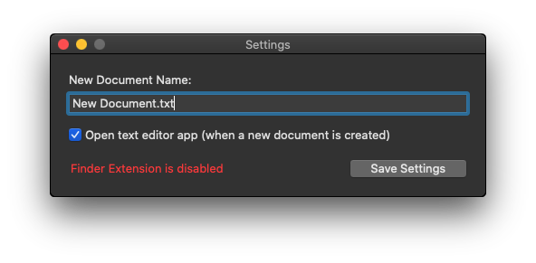
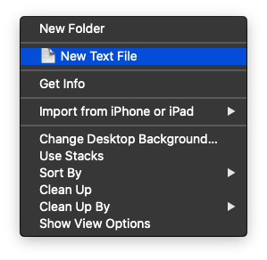

# FinderMate

## Requirements

- Minimum macOS version: 10.14
- **macOS Catalina 10.15 not yet supported**

## Setup

1. Open **FinderMate** app
2. Edit **New Document Name**
3. Configure the option to open text editor app after creating a new document
4. Click **Save Settings**
5. Enable **CreateTextFile** extension in System Preferences > Extensions



## Usage

Right-click in Finder or on Desktop to open contextual menu and choose **📄 New Text File**.



If a file exists with same name in target folder, FinderMate extension will create a new file with incrementing number.

## Entitlements

FinderMate is sandboxed, but it has a few extra entitlements:

```
com.apple.security.application-groups: $(TeamIdentifierPrefix)com.github.jlehikoinen.FinderMate
com.apple.security.temporary-exception.files.home-relative-path.read-write: /
com.apple.security.temporary-exception.shared-preference.read-write: true
```

## Additional information

Tested on macOS 10.14.6